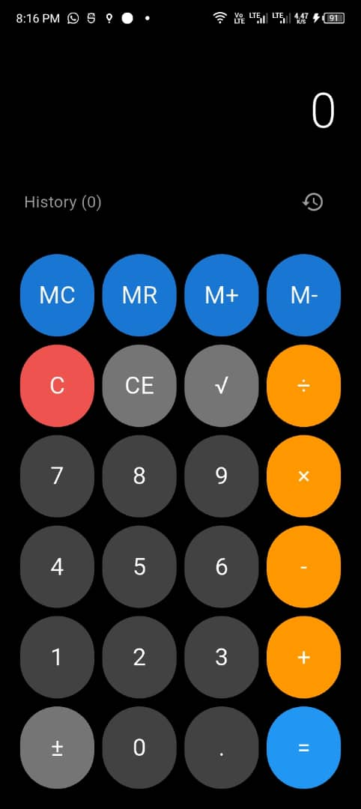

# 📱 Calculator App

A clean and intuitive Calculator app featuring **two modes**:  
- **Basic Calculator** for everyday arithmetic  
- **Scientific Calculator** for trigonometric and advanced functions

---

## 🖼️ User Interfaces

### 1. Basic Calculator UI
- Large, clear buttons with responsive layout
- Standard arithmetic operations: `+`, `−`, `×`, `÷`
- Memory functions: `MC`, `MR`, `M+`, `M−`
- Extra features: `C`, `CE`, `√`, `±`, `.`, `=`
- History tracking of past calculations

## Screenshots



### 2. Scientific Calculator UI
- All features of the Basic Calculator
- Includes advanced operations:
  - `sin`, `cos`, `tan`
  - Possibly `log`, `ln`, `π`, `e`, `x²`, `x³` (if included)
- Great for students and professionals needing trigonometric calculations

---

## 🔧 Features

- **Dual Mode Interface**  
  Switch seamlessly between **Basic** and **Scientific** views.

- **Smart Input Handling**  
  Supports chaining operations and real-time result display.

- **Memory Support**  
  Store and recall values with `MC`, `MR`, `M+`, `M−`.

- **History View**  
  Access and reuse past calculations quickly.

---

## 🚀 Getting Started

### Prerequisites

- Android Studio (for Android build)
- Flutter or Java/Kotlin (depending on implementation)

### Installation

```bash
git clone https://github.com/your-username/calculator-app.git
cd calculator-app
# Follow platform-specific setup (e.g., Flutter: `flutter run`)
